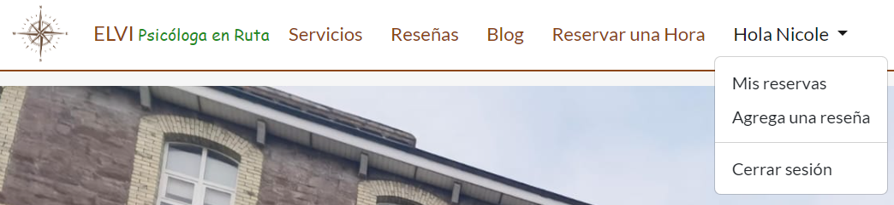

# 
Elvira Espinoza Ahumada

[Click aquí para ver la versión en vivo](https://elvira-espinoza-spanish-v-fe945efbedfa.herokuapp.com/)

This is a Spanish version of one of my projects. As the request of my client, some changes have been incorporated and new elements have been added in this version. You can review the original version in English here [Link to the english version](https://elvira-espinoza-50ffaf8a32fa.herokuapp.com/)

----------------------------------------------------------------------------------------------------------------------------

## Índice - Tabla de contenido

- [Experiencia de usuario (UX)](#experiencia-usuario-ux)
- [Diseño](#diseño)
- [Tecnologías utilizadas](#tecnologías-usadas)
- [Características](#características)
- [Pruebas](#pruebas)
- [Implementación](#implementación)
- [Créditos](#créditos)

# Experiencia de usuario (UX)
El objetivo de este sitio web es crear una plataforma fácil de usar donde los usuarios puedan obtener información sobre Elvira, sus especialidades, enfoques de tratamiento y detalles de contacto. Esto ayuda a los clientes potenciales a comprender la experiencia del terapeuta y decidir si es la persona adecuada para ellos. Al mismo tiempo, el sitio sirve como herramienta de marketing para atraer nuevos clientes gracias a las reseñas que los usuarios pueden publicar, demostrando la experiencia del terapeuta y destacando sus historias de éxito.

## Objetivos del proyecto

## Metodología ágil
Este proyecto se creó utilizando principios ágiles a través de un tablero de proyecto en Github, donde pude seleccionar qué funciones aún estaban por hacer, qué funciones estaban en progreso mientras se trabajaba en ellas y qué funciones cumplían con la definición de terminado. Se agregaron etiquetas para ordenar los problemas según su importancia.
En cuanto a las historias de usuario, las creé en base a una plantilla, que actuó como esqueleto para crear nuevas historias de usuario. Cada historia de usuario seguiría la convención:

**Como (rol) yo puedo (capacidad) para que (beneficio_recibido)**

con sus respectivos "Criterios de aceptación" que deberían cumplirse para que el problema de la Historia de usuario se marque como Listo. Los criterios de aceptación fueron muy útiles para garantizar que se completaran todas las tareas necesarias, ayudándome a organizar y priorizar mi flujo de trabajo. Esto ha sido esencial debido al tiempo muy limitado que teníamos para completar este proyecto.

## Priorización de Moscú
Seguí el método de priorización de MoSCoW para este proyecto, con las siguientes etiquetas:

Debe contener: los componentes críticos 'requeridos' del proyecto. 

Debería tener: los componentes que son valiosos para el proyecto pero que no son absolutamente "vitales" en la etapa MVP. Los "debe contener" deben recibir prioridad sobre los "debería contener".

Podría tener: estas son las características que son una 'bonificación' para el proyecto, sería bueno tenerlas en esta fase, pero solo si las tareas más importantes se han completado primero y el tiempo lo permite.

## Historias de usuarios 

### Épicas

- Registro de usuario e inicio de sesión.
- Página de inicio (formulario de contacto)
- Servicios 
- Reservar citas, editarlas y eliminarlas.
- Publicar una reseña 
- Panel de administración 
- Mantener un diseño consistente teniendo en cuenta la capacidad de respuesta.ç

| Historia de usuario| Prioridad |
|---------------------------------------------------------------------------------------------------------------------------------|-------------|
|  #1 |Como **Usuario** puedo **hacer clic en el enlace Acerca de/servicios** para poder **leer sobre el especialista y los servicios ofrecidos**|**DEBE TENER**|
|  #2 |Como **visitante del sitio web del psicólogo** quiero **navegar fácilmente en la página** para **que pueda tener una idea clara sobre el contenido y el sistema de reservas**|**DEBE TENER**|
|  #3 |Como **Administrador** puedo **actualizar el contenido de la página Acerca de** para que **está disponible en el sitio**|**PODRÍA TENER**|
|  #4 |Como **usuario nuevo** quiero **crear una nueva cuenta** para que **pueda facilitar futuras reservas y dejar una reseña**|**DEBE TENER**|
|  #5 |Como **usuario registrado** quiero **iniciar sesión con mis credenciales** para **poder acceder a mi cuenta.**|**DEBE TENER**|
|  #6 |Como **usuario** quiero **ver la disponibilidad del psicólogo** para **poder elegir y reservar un horario conveniente**|**DEBE TENER**|
|  #7 |Como **usuario** quiero **ver mi lista de reservas** para **poder reprogramar una cita**|**DEBE TENER**|
|  #8 |Como **usuario** quiero **ver mi lista de reservas** para **poder eliminar una cita**|**DEBE TENER**|
|  #9 |Como **usuario** puedo **completar un formulario de contacto** para **poder enviar una solicitud para el especialista**|**DEBE TENER**|
|  #10 |Como **usuario del sitio** puedo **ver una lista paginada de reseñas** para **poder seleccionar qué reseña quiero ver**|**DEBE TENER**|
|  #11 |Como **usuario** puedo **crear reseñas** para que **otros usuarios puedan leer sobre mi experiencia con el especialista**|**DEBE TENER**|
|  #12 |Como usuario puedo **hacer clic en una reseña** para poder leer el texto completo si es un texto muy largo**|**PODRÍA TENER**|
|  #13 |Como **Administrador del sitio que utiliza el sistema de reservas**, quiero **tener un panel de control** para **poder administrar mi disponibilidad, ver las próximas citas y bloquear franjas horarias.**||**PODRÍA TENER**|
|  #14 |Como **administrador del sitio** puedo **aprobar o eliminar reseñas** para **poder filtrar reseñas objetables y administrar el contenido de mi sitio web**||**DEBE TENER**|

# Diseño

## Esquema de colores

Los colores fueron seleccionados con la intención de complementar los colores del logo, en una mezcla de verde y marrón. El logo fue proporcionado por Elvira y el color tiene un significado especial para ella, así que intenté mantener la paleta de colores que ella quería, pero también considerando visibilidad y contrastes para una mejor experiencia de usuario.

## Marcos (wireframes)
Fueron creados usando Balsamiq. Las secciones siguientes muestran los marcos estructurales individuales para diferentes dispositivos:

- Página de inicio
La página de inicio tiene una imagen principal, una sección de bienvenida y un formulario de contacto, debajo del formulario de contacto hay un botón "¡Lea más sobre mí!" que va directamente a la página de Servicios. 
<detalles>

Haga clic para ver los esquemas de la página de inicio

</detalles>

- Acerca de/Servicios
Esta página tiene 2 secciones, una sección "Acerca de mí" donde los usuarios pueden leer sobre la misión y visión de Elvira. 
La segunda sección tiene una lista de los servicios prestados al especialista y en la parte inferior de la página hay un botón en el que los usuarios pueden hacer clic si deciden seguir adelante reservando una cita. Para acceder a la página de reservas, los usuarios deben iniciar sesión o registrarse primero. 

<detalles>

Haga clic para ver esquemas de la página de servicios

[img](Documentacion/esquemas/servicios.PNG)
</detalles>

- Página de reserva de citas (Agregar una cita)

<detalles>

Haga clic para ver esquemas de la página de reservas

[img](Documentacion/esquemas/reserva.hora.PNG)
</detalles>

- Página de de reserva citas (lista de citas)

<detalles>

Haga clic para ver los esquemas de la lista de citas

[img](Documentacion/esquemas/mis.reservas.PNG)
</detalles>

- Página de reseñas (Agregar una reseña)
<detalles>

Haga clic para ver esquemas  de la página Agregar reseña

[img](Documentacion/esquemas/agregar.reseña.PNG)
</detalles>

- Página de reseñas (lista de reseñas)
<detalles>

Haga clic para ver esquemas  de la página de lista de reseñas

[img](Documentacion/esquemas/Reseñas.PNG)
</detalles>

- Página de Blog 
<detalles>

Haga clic para ver esquemas  de la página de Blog

[img](Documentacion/esquemas/blog.PNG)
</detalles>

## Esquema de base de datos
Los diagramas de entidad-relación (ERD) ayudan al desarrollador a establecer conexiones entre las bases de datos y la información. La creación de un ERD me ayudó a comprender cómo se relacionan las tablas entre sí y su conexión con la base de datos PostgreSQL. Utilicé LucidChart para crear el diagrama y la flecha representa cómo se relacionan los campos de datos entre sí.

Mi modelo de reserva y parte del diseño de mi sitio web se inspiraron en el tutorial del blog del Code Institute y [FreeFido](https://github.com/amylour/FreeFido_v2) y [thebookbooth1](https://github .com/hiboibrahim/thebookbooth1) proyectos durante mi aprendizaje de Django. Me ayudaron a obtener una buena comprensión  para luego desarrollar mis modelos de revisión y contacto.

## CRUD
La funcionalidad CRUD se implementó tanto en la reserva de cursos como en los comentarios donde:

- Crear: Un usuario autenticado puede crear una reserva o dejar una reseña.
- Leer: un usuario puede leer la información y los comentarios de otros usuarios.
- Actualización: un usuario autenticado puede editar y actualizar sus propias reservas.
- Eliminar: un usuario autenticado puede eliminar sus propias reservas.

En este proyecto, la función "reserva" tiene disponible la funcionalidad CRUD completa, mientras que "reseñas" permite a los usuarios CREAR y LEER únicamente. No sentí necesario agregar la opción de ACTUALIZAR o ELIMINAR una reseña, ya que no es común que los usuarios regresen a un sitio para modificar o eliminar una reseña. Esa funcionalidad funciona mejor en los blogs.  

La publicación se puede eliminar desde el Panel de administración.

## Data Models

### Modelo de usuario de Allauth
El modelo de usuario se construyó utilizando la biblioteca Allauth de Django.

**Todos los usuarios:**
- Pueden ver los servicios prestados para el especialista y una lista de reseñas de otros usuarios.

**Solo usuarios registrados:**
- Puede reservar cita.
- Puede crear, leer, actualizar y eliminar una cita desde su panel personal (funcionalidad CRUD de front-end)
- Pueden publicar una reseña, pero solo después de haber programado una cita.

# Tecnologías utilizadas

## Idiomas

- [HTML](https://en.wikipedia.org/wiki/HTML5): se utiliza para el contenido principal del sitio.
- [CSS](https://en.wikipedia.org/wiki/CSS): se utiliza para el diseño y la disposición del sitio principal.
- [Python](https://en.wikipedia.org/wiki/Python_(programming_language)): se utiliza como lenguaje de programación back-end.
- [JavaScript](https://en.wikipedia.org/wiki/JavaScript): se utiliza para la interacción del usuario en el sitio para cerrar automáticamente mensajes de Django y para manejar el menú desplegable de notificaciones y las funciones de eliminación de notificaciones.

## Marcos, bibliotecas y herramientas

- [Am I Responsive] (https://ui.dev/amiresponsive): se utiliza para verificar la capacidad de respuesta del sitio web en diferentes dispositivos.

- [Bootstrap v5.3.2](https://getbootstrap.com/): se utiliza para ayudar con la capacidad de respuesta del sitio y para ayudar a codificar parte del diseño.

- [Balsamiq](https://balsamiq.com/) - Se utiliza para crear los wireframes durante el proceso de diseño.

- [Cloudinary](https://cloudinary.com/): se utiliza para el almacenamiento de archivos estáticos en línea.

- [Django](https://www.djangoproject.com/): se utiliza como marco de Python para el sitio.

- [ElephantSQL](https://www.elephantsql.com/): se utiliza como base de datos de Postgres.

- [Favicon.io](https://favicon.io/): se utiliza para crear y agregar el favicon a la pestaña del navegador

- [Font Awesome](https://fontawesome.com/): se utiliza para agregar íconos al sitio con fines estéticos y de UX.

- [GitHub](https://github.com/): se utiliza para almacenar el código del proyecto después de crearlo en GitPod. 

- [Gitpod](https://www.gitpod.io/): se utiliza para crear, editar y obtener una vista previa del código del proyecto.

- [Fuentes de Google] (https://fonts.google.com/): se utiliza para importar las fuentes al estilo. 
css que se utilizan en todas las páginas del proyecto.

- [Heroku](https://dashboard.heroku.com/): se utiliza para alojar el sitio back-end implementado.

- [PostgreSQL](https://www.postgresql.org/) - Se utiliza como gestión de bases de datos relacionales.

- [W3C](https://www.w3.org/) - Se utiliza para la validación de HTML y CSS.

- [WAVE](https://wave.webaim.org/): se utiliza para la evaluación de accesibilidad.

# Características

## Menú de navegación 
- La barra de navegación aparece en cada página para que los usuarios puedan navegar fácilmente por el sitio y también es fija, por lo que los usuarios no necesitan volver a la parte superior de la página si desean pasar a una página diferente.

- Cuando el usuario no haya iniciado sesión, la barra de navegación mostrará enlaces para 'ELVI Psicóloga en Ruta' (Página de inicio), 'Servicios', 'Reseñas', 'Blog' e 'Iniciar sesión/Registrarse'

- Si el usuario ha iniciado sesión, el lado izquierdo del menú mostrará enlaces a páginas que solo los usuarios autorizados pueden visitar y usar, son: 'Reservar una hora' y un menú desplegable cuando el nombre de usuario y los enlaces para 'Mis Reservas", "Agregar una reseña" y "Cerrar sesión". De lo contrario, el usuario tendrá la opción de 'Registrarse' o 'Iniciar sesión'

- La barra de navegación responde completamente y se colapsa en un menú de hamburguesas para pantallas de tamaño mediano y pequeño.

## Imagen página de inicio

-La imagen principal muestra una imagen grande de Elvira, que fue elegida por ella, y que representa el estilo de psicología que practica, en un ambiente de confianza y relajación. 

- Mas abajo hay un breve párrafo de bienvenida al usuario, con un botón de  "Lee más acerca de mi!" que lleva directamente a la página de servicios. Este botón sólo es visible cuando ningún usuario ha iniciado sesión. 

## Formulario de contacto
- 

## Pie de página
- Al igual que la barra de navegación, el pie de página aparece en cada página y proporciona enlaces a las respectivas páginas de redes sociales.
- Los enlaces se abren en una nueva pestaña.

## Página de inicio de sesión y registro

- El registro permite a los usuarios reservar una cita con el terapeuta y también publicar una reseña después de su reserva. Los usuarios deben agregar su correo electrónico, nombre de usuario y contraseña dos veces para garantizar que se guarde el correcto. Si algún campo no se completa correctamente, se utiliza un mensaje en pantalla para informar al usuario cómo proceder para completar el formulario.

- También se rediseñó la página "Olvidé mi contraseña" a partir de las plantillas AllAuth, pero su funcionalidad completa aún no está activada para esta versión.

## Página de inicio de sesión

## Sección Acerca de..

## Sección de servicios 

## Reserva y cita 

- Esta página contiene un formulario sencillo con una sección para detalles del usuario y otra sección para elegir fecha y hora. Todos los campos son obligatorios: Nombre, Apellido, Correo electrónico y Servicio (consulta online, terapia individual/familiar y Taller).
- No hay límite de reservas, los usuarios pueden reservar tantas citas como quieran.  
- El usuario puede crear, editar y eliminar sus reservas, se le informa si una fecha/hora no está disponible y ve un mensaje en pantalla si su reserva se guarda.
- Para crear una reserva, se informa al usuario de los campos necesarios a completar (*)
- Hay disponible una selección desplegable de 'Servicios'. Esta información es importante para más adelante, en caso de que el usuario quiera publicar una reseña, estaría asociada a la fecha de la reserva y al servicio reservado. Lamentablemente, esa parte del modelo no está implementada al 100% en esta versión. 
- La fecha y la hora se pueden seleccionar a través de un widget de calendario para la fecha y un menú de selección desplegable que muestra los horarios de 9 a. m. a 6 p. m. 
- Si una combinación de fecha y hora no está disponible, se informa al usuario mediante un mensaje de advertencia. 
- Los comentarios de los usuarios se envían por mensaje una vez que se ha enviado y actualizado una reserva, el mensaje desaparece después de 5 segundos.

## Lista de citas de usuarios
- Panel de control solo visible para usuarios registrados que hayan realizado una reserva anterior
- Debajo de la lista de citas el usuario encontrará un ícono para publicar una reseña (bajo el ícono también es posible ver un párrafo que indica "Deja una reseña" para una mejor accesibilidad para todos los usuarios).

## Editar citas
- Cuando inicie sesión, aparecerá un ícono de edición para permitir a los usuarios modificar y actualizar sus reservas si lo desean.

## Eliminar citas
- Cuando inicie sesión, aparecerá un icono de papelera para permitir a los usuarios eliminar sus reservas si lo desean.
- Un mensaje aparecerá en la parte superior de la pantalla cada vez que el usuario reserve una hora, la modifique o la elimine. 

## Lista de las últimas reseñas
- En esta página se mostrarán todas las reseñas publicadas por diferentes usuarios, en orden de la más nueva a la más antigua.
- Si no hay reseñas aparecerá un mensaje "No hay reseñas" y un botón para volver a la página principal. 

- Cada recuadro mostrará el nombre del autor, la fecha de publicación, el servicio reservado, una sección del cuerpo para los comentarios y una escala de calificación del 1 al 5 representada por estrellas.

- Esta sección se diseñó para no mostrar más de 6 reseñas por página, por lo que cuenta con una barra de paginación, para cuando se excede las 6 reseñas.

- Si la sección del cuerpo de los comentarios supera una determinada cantidad de caracteres, los usuarios verán un hipervínculo "ver más" que les permitirá mostrar el contenido completo en una nueva ventana, favoreciendo una mejor visualización del contenido junto con un botón para volver a la página de reseñas.

## Agregar una reseña
Esta página contiene un formulario con detalles de: fecha de reserva, servicio, fecha, calificación y un comentario. Todos los campos son solicitados para enviar el formulario.

## Cerrar sesión

## Panel de administración

- Para acceder al panel de administración, el usuario administrador agrega '/admin/' al final de la URL para mostrar 
https://elvira-espinoza-spanish-v-fe945efbedfa.herokuapp.com/admin Se solicita un nombre de usuario y contraseña. Para este proyecto, no se necesita la aprobación del administrador, por lo que los usuarios registrados y conectados tienen acceso instantáneo para hacer una reserva y publicar una reseña.

- El administrador puede controlar las reservas, reseñas y solicitudes de contacto de los usuarios a través del panel de administración de Django.

# Pruebas

## Prueba del validador

El sitio web fue probado utilizando las herramientas puestas a disposición por el World Wide Web Consortium, también conocido como "W3C".

Las dos herramientas utilizadas fueron el Servicio de Validación de Marcado y el Servicio de Validación de CSS. Ambas herramientas se utilizaron para probar el sitio web por URL y también por entrada directa, y los resultados se muestran a continuación.

No se visualizaron errores para todo HTML o CSS en todas las pruebas. Se mostraron algunas advertencias.

- Validación HTML por entrada directa

     
- Validación CSS por entrada directa

## Pruebas manuales

El sitio se probó manualmente en una variedad de dispositivos para garantizar que todos los enlaces y el estilo funcionen correctamente y para garantizar la capacidad de respuesta en una variedad de dispositivos. Se probaron todas las funciones de la página para garantizar que la funcionalidad no se viera afectada de ninguna manera. 

#### Pruebas de registro de cuenta
| Prueba |Resultado |
|--|--|
| El usuario puede iniciar sesión | Pasa |
| El usuario puede cerrar sesión | Pasa |
| Se muestran mensajes | Pasa |
| Los mensajes se pueden descartar mediante botón y tiempo de espera | Pasa |

#### Pruebas de navegación del usuario

| Prueba | Resultado |
|--|--|
| El usuario puede navegar fácilmente por sitio web | Pasa |
| El usuario puede acceder a la página de servicios | Pasa|
| El usuario puede acceder a la página de reseñas | Pasa|
| El usuario puede acceder a la página de reservas | Pasa|
| El usuario accede a su página de reservas en el panel|Pasa|
| El usuario puede rellenar y enviar un formulario de contacto |Pasa|
| El superusuario puede acceder a la página de administración|Pasa|

#### Pruebas de autorización de cuenta

| Prueba | Resultado |
|--|--|
| Sólo el superusuario puede acceder a la página de administración |Pasar|
| El usuario no autorizado no accederá a la página para agregar reservas| Pase |
| El usuario no autorizado no accederá a la página para agregar reseñas| Pase|

#### Pruebas de reserva

| Prueba |Resultado |
|--|--|
|El usuario puede realizar una reserva | Pasa |
|El usuario puede ver todas sus reservas | Pasa |
|El usuario puede editar la reserva | Pasa |
|El usuario puede eliminar su reserva | Pasa |
|El usuario puede realizar más de una reserva | Pasa |

#### Prueba de reseñas

| Prueba |Resultado |
|--|--|
|El usuario puede publicar una reseña | Pasa |
|El usuario puede ver una lista de las últimas reseñas | Pasa |
|El usuario puede ver una reseña en detalle | Pasa |

## Compatibilidad del navegador

Las pruebas se llevaron a cabo en múltiples navegadores como Google Chrome, Microsoft Edge, Mozilla Firefox, Brave, Safari y Opera. Las pruebas se realizaron en un Apple iPhone, Apple iPhone 13, Samsung Galaxy S20 FE, Samsung Galaxy A51 y Apple iPad Pro.

## Lighthouse

Se realizó una prueba en todas las páginas utilizando Lighthouse dentro de Google Chrome para verificar que se cumplieran los estándares de rendimiento y accesibilidad y para garantizar que se siguieran las mejores prácticas.

### Página de inicio

### Página Acerca de / Servicios

### Página de reserva de cita

### Página de reseñas

# Implementación 
Este proyecto se implementó usando Github y Heroku.
La aplicación implementada en vivo se puede encontrar implementada en [Heroku](https://elvira-espinoza-spanish-v-fe945efbedfa.herokuapp.com/).

### Clonación del repositorio de GitHub

Puede clonar el repositorio para usarlo localmente siguiendo estos pasos:

1. Navega hasta el repositorio de GitHub que deseas clonar.
2. Haga clic en el botón desplegable del código.
3. haga clic en HTTPS
4. Copie el enlace del repositorio al portapapeles.
5. Abra el IDE de su elección (git debe estar instalado para los siguientes pasos)
6. Escriba git clone copy-git-url en la terminal IDE

El proyecto ahora se clonará localmente para que lo utilices.

### API 
Este proyecto utiliza la API de Cloudinary para almacenar activos multimedia en línea, debido a que Heroku no conserva este tipo de datos.

Para obtener su propia clave API de Cloudinary, cree una cuenta e inicie sesión.

1. Para interés principal, puede elegir Medios programables para API de imagen y video.
2. Opcional: edite el nombre de su nube asignado a algo más memorable.
3. En su panel de Cloudinary, puede copiar su variable de entorno API.
4. Asegúrese de eliminar CLOUDINARY_URL= como parte del valor de API; esta es la clave.

### Cómo ejecutar el proyecto localmente 
Una vez que el proyecto esté clonado o bifurcado, para ejecutarlo localmente, deberá seguir estos pasos:

1. Instale los paquetes aplicables que se encuentren en el archivo requisitos.txt.
instalación de pip3 -r requisitos.txt. 

Si tiene sus propios paquetes instalados, entonces el archivo de requisitos debe actualizarse usando:
pip3 congelado --local > requisitos.txt

2. Cree un nuevo archivo llamado env.py en el directorio principal.
3. Agregue el valor DATABASE_URL y la SECRET_KEY elegida y la URL de Cloudinary al archivo env.py.
4. Comente la configuración de la base de datos predeterminada.
5. Agregue Cloudinary y el resto de bibliotecas que necesita a la lista de aplicaciones instaladas en settings.py
6. Agregue la configuración de los archivos ESTÁTICOS: la URL, la ruta de almacenamiento, la ruta del directorio, la ruta raíz, la URL del medio y la ruta de almacenamiento de archivos predeterminada.
7. Vincule el archivo al directorio de plantillas en Heroku.
8. Cambie el directorio de plantillas a TEMPLATES_DIR
9. Agregue Heroku a la lista ALLOWED_HOSTS con el formato ['app_name.heroku.com', 'localhost']
10. Guarde todos los archivos y realice las migraciones necesarias. 
python3 manage.py makemigrations
11. Migrar los datos a la base de datos:
python3 manage.py migrate
12. Crea un superusuario: 
python3 manage.py createsuperuser

Todo debería estar listo ahora, así que ejecuta la aplicación Django nuevamente: 
python3 manage.py runserver

### Implementación de Heroku
Este proyecto utiliza Heroku, una plataforma como servicio (PaaS) que permite a los desarrolladores crear, ejecutar y operar aplicaciones completamente en la nube.

Los pasos de implementación son los siguientes, después de la configuración de la cuenta:
Asegúrese de que DEBUG = False en settings.py

Heroku necesita dos archivos adicionales para poder implementarse correctamente.

Cree un nuevo archivo en el directorio principal llamado Procfile (no use ninguna extensión para el nombre de este archivo)
El Procfile se puede crear con el siguiente comando:

echo web: gunicorn nombre_aplicación.wsgi > Procfile
reemplace app_name con el nombre de su aplicación Django principal; la carpeta donde se encuentra settings.py

1. Seleccione Nuevo en la esquina superior derecha de su Panel de Heroku y seleccione Crear nueva aplicación en el menú desplegable.
2. El nombre de su aplicación debe ser único y luego elija la región más cercana a usted (UE o EE. UU.) y, finalmente, seleccione Crear aplicación.
3. Desde la nueva configuración de la aplicación, haga clic en Revelar variables de configuración y configure sus variables de entorno.
(¡¡Agrega las claves!!)

Vaya a la pestaña de implementación en Heroku y conéctese a GitHub, luego al repositorio requerido. 

Desplácese hasta la parte inferior de la página de implementación y haga clic en Habilitar implementaciones automáticas para implementaciones automáticas o Implementar rama para implementar manualmente. Las ramas implementadas manualmente deberán volver a implementarse cada vez que se actualice el repositorio de GitHub.
Haga clic en "Abrir aplicación" para ver el sitio en vivo implementado.

¡El proyecto ahora debería estar conectado e implementado en Heroku!

# Créditos

- Gracias a mi mentor Chris Quinn por su apoyo, orientación y consejos positivos.
- Gracias a mis compañeros y amigos, y a la comunidad Slack de Code Institute por su enseñanza y apoyo.

